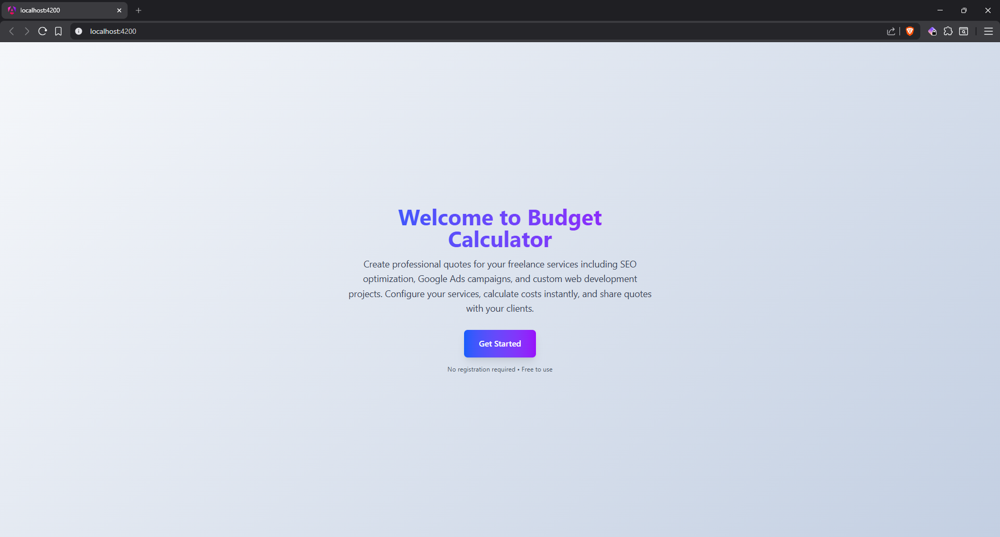
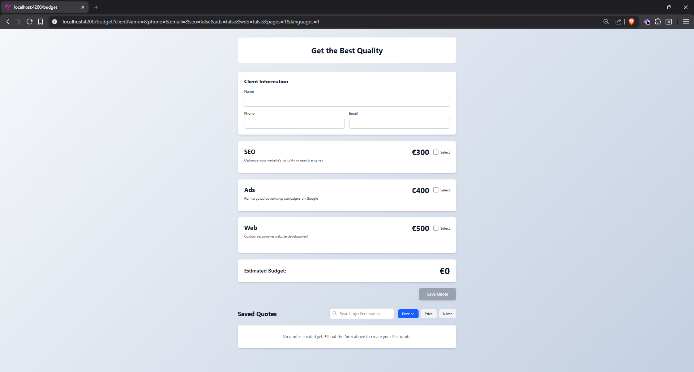

# 💰 Budget Calculator - Freelance Quote Management Tool

A modern, professional quote calculator application built with Angular v21, designed for freelancers to create, manage, and share service quotes with clients. Features real-time price calculation, persistent state management, and shareable URLs for collaborative quote reviews.

## Preview - Welcome Page:



## ✨ Features

- 🎯 **Service Configuration** - SEO, Google Ads, and custom web development quotes
- 💵 **Real-time Calculation** - Instant price updates as services are configured
- 📋 **Quote Management** - Save, search, and sort multiple client quotes
- 🔗 **Shareable URLs** - Share exact quote configurations via URL parameters
- 🔍 **Advanced Filtering** - Search by client name with case-insensitive matching
- 📊 **Flexible Sorting** - Sort by date, price, or name with direction toggle
- ♿ **Full Accessibility** - WCAG 2.1 AA compliant with ARIA support
- 📱 **Responsive Design** - Mobile-first approach with Tailwind CSS v4
- 🚀 **Performance Optimized** - OnPush change detection and signal-based architecture

## Preview - Main Page:




## 🛠️ Tech Stack

- **Framework:** Angular v21.0.0
- **Language:** TypeScript 5.9
- **Styling:** Tailwind CSS v4.1.12
- **Forms:** Angular Signal Forms
- **Testing:** Vitest 4.0.8 with 79 passing tests
- **Package Manager:** Bun v1.3.3
- **Server:** Express v5.1.0 with SSR support

## 📁 Project Structure

```
src/
├── app/
│   ├── components/
│   │   ├── budgets-list/         # Quote cards display
│   │   ├── help-modal/           # Accessible modal dialogs
│   │   ├── page-header/          # Page title component
│   │   ├── products-form/        # Main quote calculator
│   │   ├── website-panel/        # Web service configuration
│   │   └── welcome-page/         # Landing page
│   ├── constants/
│   │   └── help-content.ts       # Centralized help text
│   ├── models/
│   │   ├── quote.ts              # Quote interface
│   │   ├── quote-form.ts         # Form model
│   │   └── sort-option.ts        # Sort types
│   └── services/
│       └── budget.ts             # Price calculation service
├── styles.css                     # Global styles + Tailwind
└── index.html                     # App entry point
```

## 🚀 Getting Started

### Prerequisites

- Node.js 20+
- Bun v1.3.3 (or npm/yarn)

### Installation

```bash
# Clone repository
git clone <repository-url>
cd SPRINT-6

# Install dependencies
bun install

# Start development server
bun start
```

### Development Server

```bash
bun start          # Start dev server at http://localhost:4200
bun run build      # Build for production
bun run test       # Run test suite
bun run test:ui    # Run tests with UI
```

## 🧪 Testing

Comprehensive test coverage with **79 passing tests** across all components:

- ✅ **33 tests** - ProductsForm (form logic, calculations, URL sync)
- ✅ **15 tests** - WebsitePanel (increment/decrement, validation)
- ✅ **9 tests** - Budget Service (price calculations, quote management)
- ✅ **7 tests** - HelpModal (dialog behavior, accessibility)
- ✅ **6 tests** - BudgetsList (rendering, empty states)
- ✅ **6 tests** - WelcomePage (navigation, button interaction)
- ✅ **3 tests** - Additional unit tests

```bash
bun run test       # Run all tests
bun run test:ui    # Interactive test UI
```

## 🏗️ Architecture Highlights

### Modern Angular v21 Patterns

- ✅ **Standalone Components** - No NgModules, fully modular
- ✅ **Signal-based Reactivity** - Modern state management
- ✅ **Signal Forms** - Latest @angular/forms/signals API
- ✅ **Modern Control Flow** - @if, @for, @switch syntax
- ✅ **inject() Function** - Modern dependency injection
- ✅ **OnPush Change Detection** - Maximum performance
- ✅ **Computed Signals** - Derived state management
- ✅ **Effect System** - Side effect handling

### Key Features Implementation

**URL State Synchronization**
- Bidirectional sync between form state and URL query parameters
- Enables shareable quote configurations
- Uses `toSignal()` for Observable-to-Signal conversion

**Price Calculation**
- Single source of truth in Budget service
- Real-time computed pricing with signals
- Customizable rates per service type

**Search & Sort**
- Case-insensitive client name filtering
- Three sort criteria: date, price, name
- Bidirectional sort direction toggle

## ♿ Accessibility

WCAG 2.1 AA compliant with comprehensive ARIA support:

- ✅ Semantic HTML structure (`<dialog>`, `<form>`, `<ul>`)
- ✅ ARIA labels and descriptions for all interactive elements
- ✅ Live regions for dynamic content announcements
- ✅ Keyboard navigation support throughout
- ✅ Screen reader tested (NVDA/VoiceOver)
- ✅ Focus management and visible focus indicators
- ✅ Color contrast meets accessibility standards

## 🎨 Design System

**Tailwind CSS v4** with modern utility classes:
- Gradient text effects
- Consistent spacing scale
- Responsive design patterns
- Custom dialog styling
- Focus ring utilities

## 📝 Code Quality

Follows industry best practices:

- ✅ **SOLID** principles throughout
- ✅ **DRY** - No code duplication
- ✅ **KISS** - Simple, readable code
- ✅ **YAGNI** - No unused features
- ✅ TypeScript strict mode enabled
- ✅ Comprehensive test coverage
- ✅ ESLint + Prettier configured

## 🌐 Browser Support

- Chrome/Edge (latest)
- Firefox (latest)
- Safari (latest)
- Mobile browsers (iOS Safari, Chrome Mobile)

## 📄 License

This project is part of IT Academy Barcelona's frontend development curriculum.

## 👤 Author

**Sergio** - Frontend Development Student at IT Academy Barcelona

---

**Built with** ❤️ **using Angular v21 + Tailwind CSS v4**
